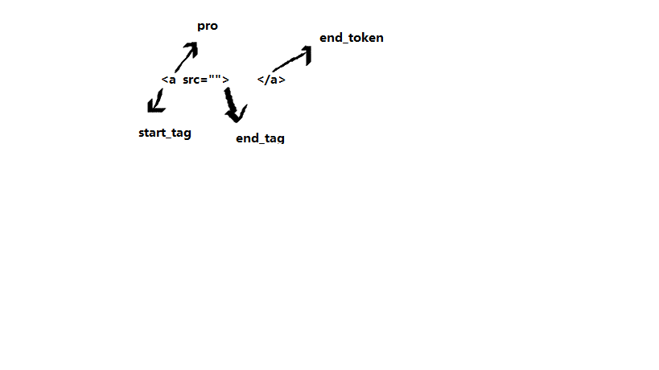

# webNote
前端知识点整理

## 主流浏览器
1. IE
2. Firefox
3. Chrome
4. Opera
5. Satari

浏览器向服务器发起请求，浏览器中显示的是网络，资源资源的的位置是由用户定义的URI(统一资源标示符)来指定。
## 浏览器的结构
1. 用户界面：地址栏,书签除却主窗口的部分
2. 浏览器引擎:用户界面和呈现引擎之间传达指令
3. 呈现引擎:负责显示请求内容，如果是HTML/CSS，则会进行解析
4. 网络:用于网络调用。比如http请求
5. JS解释器:用于解释和执行JS
6. 数据存储:持久层。用于保存数据，如cookie
7. 用户界面后端:用于绘制基本的窗口小部件，比如组合框和窗口。

## 主流程
呈现引擎一开始会从网络层请求文档的内容，内容的大小一般限制在8000个块以内。

开始解析HTML文档，并且逐个标记转化成DOM树上的DOM节点，同时解析CSS文件以及样式表中的数据。
接下来Render树会接收编译好的样式指令，生成多个带有视觉属性(颜色,尺寸)的矩形。
构建好Render树之后，会进入Layout阶段，为每个节点分配坐标。
用户界面后端会遍历每一个节点并绘制出来
>为了提升用户体验，HTML文档解析的时候，就开始构建Render树与Layout树，然后再不断解析显示。

## HTML 解析器

HTML 解析器的任务是将 HTML 标记解析成解析树。

## HTML DTD

HTML 的定义采用了 DTD 格式。此格式可用于定义 SGML 族的语言。它包括所有允许使用的元素及其属性和层次结构的定义。如上文所述，HTML DTD 无法构成与上下文无关的语法。

DTD 存在一些变体。严格模式完全遵守 HTML 规范，而其他模式可支持以前的浏览器所使用的标记。这样做的目的是确保向下兼容一些早期版本的内容。最新的严格模式 DTD 可以在这里找到：www.w3.org/TR/html4/strict.dtd
>HTML在解析的过程中经历了标记与树构建两个过程
## 浏览器标记
浏览器标记的过程中，将HTML标签作为状态机，然后去处理接下来的字符，从而更新当前状态机的属性状态



遇到`<`标记为开始，`>`为结束，而遇到`/`则判定为end_tkoen，属于标签闭合


## dom树构建
创建好dom对象之后，以属性插入的方式将其中的属性与数据插入到对应的dom对象上

## CSS解析器
浏览器会将CSS解析成StyleSheet 对象，每个对象都包含CSS规则(包含选择器和声明对象)

### 样式表层叠顺序
1. 浏览器声明
2. 用户普通声明
3. 作者普通声明
4. 作者重要声明
5. 用户重要声明

## CSS布局
HTML采用流式布局，以左上角为坐标原点，每一个父元素都是一个呈现器，都会有一个`layout`或者`reflow`,为了减少整体的重绘，只有在其父级元素或者自身变动的时候才会被标记，然后进行布局。
### 全局布局
全局布局是指触发了整个呈现树范围的布局，触发原因可能包括：

- 影响所有呈现器的全局样式更改，例如字体大小更改。
- 屏幕大小调整。
### 增量布局
增量布局是指对呈现器进行布局，避免了整体的重新布局，也就是所说的**回流**与**重绘**

>重绘(全局布局)是同步进行的,而回流(增量布局)是异步


---

## 同源策略
协议 域名 端口 同域

## 为什么浏览器不支持跨域
cookie LocalStorage Dom iframe ajax 不支持跨域

## 实现跨域
- jsonp
- cors
- postMessage(页面之间通信)
- document.domain(子域)
- window.name
- location.hash
- http-proxy
- nginx
- websocket
- 
### jsonp
利用src链接到接口，请求到的数据是一个函数的执行
```js
web端
jsonp({
    url:http://localhost:8080/jsonp,
    params:{data:'data'},
    cb:'get'
}).then(data=>{
    console.log(data);
})
function jsonp(url,params,cb){
    return new Promise((resolve,reject){
        window[cb]=function(data){
            resolve(data);
            document.body.removeChild(script);
        }
        params={...params,cb}
        ler arrs=[];
        for(let key in params){
            arrs.push(`${key}=${params[key]}`)
        }
        let script.src=`${url}?${arrs.join('&')}`;
        document.body.appendChild(script);
    })
}
sever
app.get('/jspnp',(req,res)=>{
    let {data,cb}=req.query;
    res.end(`${cb}('参数'${data})`)
})
```
只能发送get请求，容易发生XSS攻击

### cors
```
前端 3000端口
let xhr=new XMLHttpRequest;
document.cookis='put=data';
xhr.withCredentials=true;//强制携带cookie
xhr.open('GET','http://localhost:4000/cors',true);
xhr.onreadystatechange=function(){
    if(xhr.readyState==4){
        if(xhr.status>=200&&xhr.status<=300){
            console.log(xhr.response);
            console.log(xhr.getResponseHeader('name'));//获取返回头的数据
        }
    }
}


sever:
let shiteList=['localhost:3000'];//设置白名单
app.use((req,res,next)=>{
    let origin=req.header.origin;
    if(whiteList.includes(origin)){
        res.setHeader('Access-Control-Origin',origin);
        res.setHeader('Access-Control-Header','name');//允许自定义请求头
        res.setHeader('Access-Control-Methods','PUT');//允许使用的方法
        res.setHeader('Access-Control-Credentials',true);//允许cookie
        res.setHeader('Access-Control-Max-age',6);//预检测的时间间隔
        res.setHeader('Access-Control-Expose-Headers','name');//允许浏览器使用返回头的数据
    }
    next();
})

app.put('cors',function(req,res){
    req.setHeader('name','dwt');
    req.end('back data');
})
```
>使用`res.setHeader('Access-Control-Origin',origin);`后不允许cookie

### postMessage
```
a:
window.postMessage('data',localhost:3000);
window.onmessage=function(data){
    console.log(data);
}
b:
window.onmessage=function(e){
    console.log(e.data);
    e.source.postMessage('n_data',e.origin); 
}
```
### websocket
```
let socket =new WebSocket('localhost:3000');
socket.open(function(data){
    console.log(data);
})
socket.onmessage=function(e){
    console.log(e.data);
}

sever:
let wss=new WebSocket.Server({port:3000})
wss.on('connection',function(ws){
    ws.on('message',function(data){
        console.log(data);
    })
    ws.send('')
})
```

### nginx配置
```
location ~.*\.json{
    root html;
    add_header "Access-Control-Allow-Origin" "*"";
}
```
## 同源策略
协议 域名 端口 同域

## 为什么浏览器不支持跨域
cookie LocalStorage Dom iframe ajax 不支持跨域

## 实现跨域
- jsonp
- cors
- postMessage(页面之间通信)
- document.domain(子域)
- window.name
- location.hash
- http-proxy
- nginx
- websocket

### jsonp
利用src链接到接口，请求到的数据是一个函数的执行
```js
web端
jsonp({
    url:http://localhost:8080/jsonp,
    params:{data:'data'},
    cb:'get'
}).then(data=>{
    console.log(data);
})
function jsonp(url,params,cb){
    return new Promise((resolve,reject){
        window[cb]=function(data){
            resolve(data);
            document.body.removeChild(script);
        }
        params={...params,cb}
        ler arrs=[];
        for(let key in params){
            arrs.push(`${key}=${params[key]}`)
        }
        let script.src=`${url}?${arrs.join('&')}`;
        document.body.appendChild(script);
    })
}
sever
app.get('/jspnp',(req,res)=>{
    let {data,cb}=req.query;
    res.end(`${cb}('参数'${data})`)
})
```
只能发送get请求，容易发生XSS攻击

### cors
```
前端 3000端口
let xhr=new XMLHttpRequest;
document.cookis='put=data';
xhr.withCredentials=true;//强制携带cookie
xhr.open('GET','http://localhost:4000/cors',true);
xhr.onreadystatechange=function(){
    if(xhr.readyState==4){
        if(xhr.status>=200&&xhr.status<=300){
            console.log(xhr.response);
            console.log(xhr.getResponseHeader('name'));//获取返回头的数据
        }
    }
}


sever:
let shiteList=['localhost:3000'];//设置白名单
app.use((req,res,next)=>{
    let origin=req.header.origin;
    if(whiteList.includes(origin)){
        res.setHeader('Access-Control-Origin',origin);
        res.setHeader('Access-Control-Header','name');//允许自定义请求头
        res.setHeader('Access-Control-Methods','PUT');//允许使用的方法
        res.setHeader('Access-Control-Credentials',true);//允许cookie
        res.setHeader('Access-Control-Max-age',6);//预检测的时间间隔
        res.setHeader('Access-Control-Expose-Headers','name');//允许浏览器使用返回头的数据
    }
    next();
})

app.put('cors',function(req,res){
    req.setHeader('name','dwt');
    req.end('back data');
})
```
>使用`res.setHeader('Access-Control-Origin',origin);`后不允许cookie

### postMessage
```
a:
window.postMessage('data',localhost:3000);
window.onmessage=function(data){
    console.log(data);
}
b:
window.onmessage=function(e){
    console.log(e.data);
    e.source.postMessage('n_data',e.origin); 
}
```
### websocket
```
let socket =new WebSocket('localhost:3000');
socket.open(function(data){
    console.log(data);
})
socket.onmessage=function(e){
    console.log(e.data);
}

sever:
let wss=new WebSocket.Server({port:3000})
wss.on('connection',function(ws){
    ws.on('message',function(data){
        console.log(data);
    })
    ws.send('')
})
```

### nginx配置
```
location ~.*\.json{
    root html;
    add_header "Access-Control-Allow-Origin" "*"";
}
```

---
## git
```
git init //初始化git
rm -rf xxx    //删除数据
rm xxx  //删除文件
mkdir xxx //创建文件夹
cd  xxx//进入目录
ls -al展示列表
touch xxx //创建文件
cat xxx  //打开文件
vi xx   //写文件
i  //可写入
esc :wq //返回命令模式并保存
esc q! //退出

git add .或者-A或者具体文件名，提交到缓存区
git status  //查看git的状态
git commit -m XXXX//提交到历史区
git checkout xxx//用暂存区将工作区覆盖
git brach //查看分支
git brach xxx //创建分支
git checkout  分支 //切换分支
git brach -D 分支 //删除分支
git merge 分支 //合并分支

```
## webpack
```
"scripts": {
  "dev": "webpack --mode development",
  "build": "webpack --mode production"
}
```
development模式下，将侧重于功能调试和优化开发体验，包含如下内容：
>
>1. 浏览器调试工具
>2. 开发阶段的详细错误日志和提示
>3. 快速和优化的增量构建机制

production模式下，将侧重于模块体积优化和线上部署，包含如下内容：
>1. 开启所有的优化代码
>2. 更小的bundle大小
>3. 去除掉只在开发阶段运行的代码
>4. Scope hoisting和Tree-shaking
>5. 自动启用uglifyjs对代码进行压缩

### 配置
```
var path=require('path');
module.exports={
	entry:'./src/text.js',	//	解析成字符串
	output:{
		path:path.join(__dirname,'dist'),
		filename:'bulde.js'
	}
}
```
在需要配置多页面的时候，可是使用数组或者对象的方式来写entry。
```
entry:['./src/test.js','./src/t.js']
/*或者 用法：entry: {[entryChunkName: string]: string|Array<string>}*/
entry:{
    main:'./src/test.js',
    main:'./src/tack.js',
    app:'./app/first.js'
}
```
对象的方法可以将多个依赖导入到同一个chunk之中，多chunk适用于多页面网站，如果想存入不同文件，可使用[name]或[hash]等参数，这些是打包过程中的参数。
### Loader
webpack是加载打包js模块，对于css,图片等资源需要使用loader来处理
```
	module:{
		rules:[
    	    {test:'/\.css$/',use:'css-loader'}
		]
	}
```
webpack在自启动的热更新是依赖websocket进行推送，自启动socket服务


---
## XSS攻击
html编码:不同进制编码可以混用
js编码:8进制\10 16进制\x10 unicode \u0028
url编码
base64编码
payload:
- input onfouce
- img error
- svg onload
- a href
```
--!>alert(1)//会被闭合，却可以执行
```
html字符的安全转义
```
s.replace(/&/g,'&amp;')
 .replace(/'/g,'&#39;')
 .replace(/"/g,'&quot;')
 .replace(/</g,'&lt;')
 .replace(/>/g,'&gt;')
 .replace(/\//g,'&#x2f')
 ```
 遇到html转义或者处理,可以使用href或者src的方式,
 正则替换
 ```
 server:
 s.replace('script','');
 a:
 <scrscriptipt>alert(1)</scrscriptipt>
 ```
 构建闭合
 ```
 consle.log('')=>')alert('xx=>console.log('')alert('xxx');
 ```
 前端处理XSS
 将后端返回的json数据进行字符串华，再做转义处理
 ```\
 '' "" ` < > \n \b \t \f \v  \0  \r
 ```
 - 合法的url`[//[user:password@]host[port]][/]path[?query][#fragment|hash]`
 其中有很多值可缺省，就可以拿来利用
 - 不要轻信任何从别处获得的数据，要自行处理
 
 - 获得的信息进行安全正则过滤，或者使用安全库
 
 - 不要轻易在前端插入可执行代码或者dom元素
 
 - 配置安全头(兼容性不好)
 
### 存储型XSS(持久性)
将信息记录入数据库，会影响其他接触用户。
修复:前端做好数据的过滤与处理，因为后端不方便大量处理数据
### 反射型
诱导用户触发的
## CSRF
- 跨站请求伪造
- 增删改查不允许get请求
- post等协议同样会被攻击
- 对铭感操作进行处理。如cookie操作，尽量都使用加密串
## SQL注入
- 对查询语句进行转义
- 最小化权限操作
- 对用户输入做指令检查
